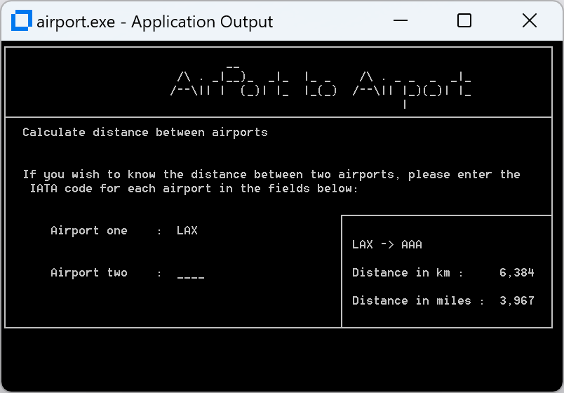

# Airport Sample

This sample is a native graphical console application that enables you to view the geographical location and the distance between airports. It shows how to use native COBOL to handle indexed data files. The information about the airport codes is stored in the airports.dat file.

This sample also demonstrates using the Micro Focus Unit Testing Framework for unit testing the Airport sample.

## Structure
The sample is structured into three projects:
* `src/aircode` - The program containing the business logic.
* `src/airport` - The program containing the UI logic.
* `test/AirportTests` - Unit tests for the **aircode** program.

The files include:
* `src/airport/airports.dat` - Data file with all airport records.
* `src/airport/Application.config` - Config file that defines the location of the .dat file to be used.

## Running the Sample

### Command line (msbuild)
1. Open a Developer Command Prompt for VS 2022.
2. Execute `msbuild Airport.sln /p:Configuration=Debug /p:Platform=x64` to build the sample.
3. Open a Visual COBOL or Enterprise Developer Command Prompt (64-bit).
4. Execute `cd bin\x64\Debug` to navigate to the directory containing the built binaries.
5. Execute `.\airport.exe` to run the sample.
6. Execute `mfurun AirportTests.mfu` to run all the tests.

### Visual Studio
1. Open Airport.sln.
2. Build the solution and start debugging.
3. Follow the instructions on the console. To see the available airport codes view the airports.dat file by opening it using the Data File Editor.
4. Open the "Micro Focus Unit Testing" tool window and click "Run All" to run all the unit tests.
5. To run the unit tests with code coverage, first edit the project properties of aircode and AirportTests, select the COBOL tab and ensure "Enable code coverage" is checked. Then click "Run with Code Coverage" in the "Micro Focus Unit Testing" tool window.

### Eclipse

1. Open Enterpise Developer for Eclipse.
2. From the Project Explorer select `Import`, `General`, `Existing projects into workspace`. Navigate to where you cloned the projects to, `Select all`, `Finish` (Do not copy the projects into the workspace).
3. Build the project.
3. Right-click the Airport project, `Run As`, `Run configurations`. Choose `COBOL Aplication`, create a new launch configuration and open it. 
4. Navigate to the `Environment` tab and add: `dd_airports` and `../airports.dat` as the variable and value.
5. You can now run and debug using your new launch configuration.
#### To run the unit tests:
1. Right-click the AirportTests project, `Run As`, 'Run configurations'. Choose `COBOL Unit test`, create a new launch configuration and open it.
2. Navigate to the `Environment` tab and add: `dd_airports` and `../../../src/airport/airports.dat` as the variable and value.
3. You can now run all the unit tests using your new launch configuration.
#### To enable code coverage:
1. For Airport and Aircode right-click on each of the projects and select `Properties -> MicroFocus -> Project Settings -> COBOL` set `Enable code coverage` to true.
2. Open the launch configuration you made to run and debug the program, navigate to the 'Dynamic analysis' Tab. Check 'Enable code coverage'
3. Build and run the sample.
4. To view code coverage results navigate to the `Code coverage` tab of the bottom plain of the IDE. Select `import`, and select the .tcz file within the coverage folder of the project folder structure. 
5. You should now be able to see and interact with coverage data.

## License

Copyright 2023 Open Text. All Rights Reserved.
This software may be used, modified, and distributed
(provided this notice is included without modification)
solely for internal demonstration purposes with other
Micro Focus software, and is otherwise subject to the EULA at
https://www.microfocus.com/en-us/legal/software-licensing.

THIS SOFTWARE IS PROVIDED "AS IS" AND ALL IMPLIED
WARRANTIES, INCLUDING THE IMPLIED WARRANTIES OF
MERCHANTABILITY AND FITNESS FOR A PARTICULAR PURPOSE,
SHALL NOT APPLY.
TO THE EXTENT PERMITTED BY LAW, IN NO EVENT WILL
MICRO FOCUS HAVE ANY LIABILITY WHATSOEVER IN CONNECTION
WITH THIS SOFTWARE.
